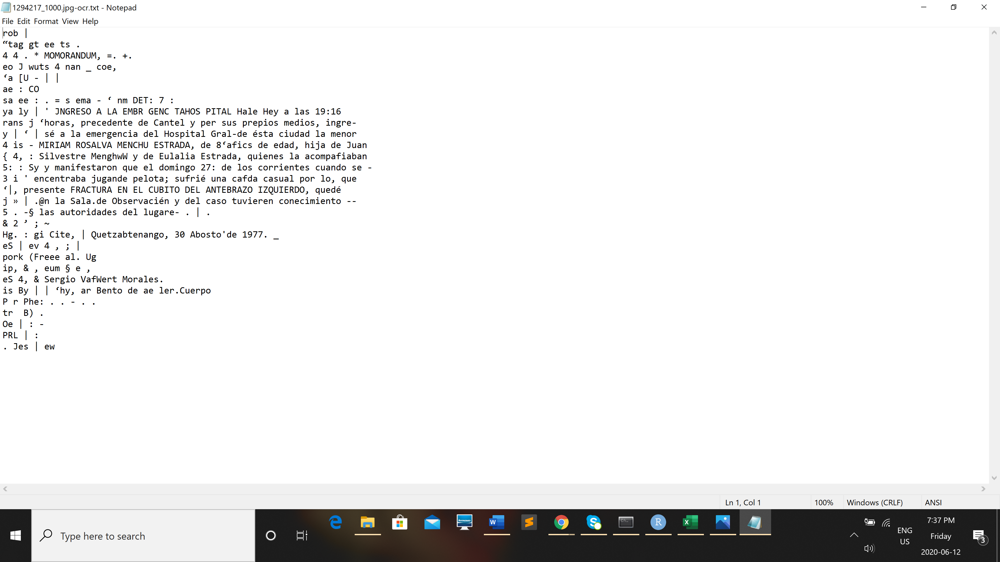

I started on the [websites](https://ahpn.lib.utexas.edu/search) search page to see what sort of info was there. I did not want to run into any issues with downloading 1000s upon 1000's of documents like I almost had in the past. I have never really explored anything to do with this topic so I ensured that I had some sort of footing before diving into this project.

One issue I am running into with this webpage which I should have known ahead of time is that the majority of the documents are in spanishso I am having to use Google Translate on the side to get information on what the documents titles are. The webpage also does not have a great search feature to I am having to browse to find which documents I want to use. Most of the paper documents are mildly illegible so I am trying to find a bunch from a certain time period I can use

I have found 102 documents from the department of criminal investigation from 1891-1981.

I am going to utilize a wget command to grab the urls for these documents. I start by creating a directory:

```
mkdir wget-Gt-DOIC-1891-1981
cd wget-Gt-DOIC-1891-1981
```

I then Call the data from the webpage which is the list of search results from the webpage https://ahpn.lib.utexas.edu/search/expediente/87475?d=1890-1899

I came up with this

 

I will use the following command to collect the list of documents on this page:
```
$ wget -r -np -w 2 --limit-rate=20k https://ahpn.lib.utexas.edu/search/expediente/87475?d=1890-1899
```

This have me an error about no binding web parameters and I remembered I needed to use wget.exe rather that just wget so I changed the code to:
```
$ wget.exe -r -np -w 2 --limit-rate=20k https://ahpn.lib.utexas.edu/search/expediente/87475?d=1890-1899
```
After running this code it only downloaded 2 things. A text file that I was able to open with Sublime and a text file containing information about how they block robots from searching their site. In the Sublime text file I was able to find a list of what looks like documents:

 

With this I copied and pasted this portion of the downloaded file into a new Sublime file, used find and replace to delete the beginning portion of what we dont need and replace it with the URL. I then had to delete the tail of each url as well

In order to find and replace the first part of the URL I simply copied the beginning of the Junk into find and the beginnong o the URL into replace.

The tail end I had to escape the parenthesis and each line had a few seperate numbers so I used a `\` to escape the parenthesis and a `.` to signify an unknown: ` ">37+.....</a> \(. pg\)</div> `

I then backspaced once they were all highlighted and voilà! A clean list of URLs.

Using `cd ..` to backed out of the directory I was in and created a new directory:
```
cd ..
cd documents
mkdir gt-doic
cd gt-doic
```
I changed my file name to urls-gt.txt in order to have wget read the urls and saved to the working directory I was in. I then used Wget to retrireve and read the URLs I had copied:
```
wget.exe -i urls-gt.txt -r --no-parent -nd -w 2 --limit-rate=100k
```
This led to me downloading all of the page information around each image but not the actual image as they are embedded in the webpage I guess.


From here I decided to take another direction and instead chose a few documents I am interested in and take a look at them in R studio, I also reached out to our Disocord to see if antone had any suggestions as to how I can solve this issue

I began by saving 5 seperate documents as .jpeg files by right clicking and saving them into the working directory I would be using in R studio. I then opened and set my working directory in the application.

I began the OCR process by telling R which libraries I needed following the instructiona from week 1:
```
library(magick)
library(magrittr)
library(tesseract)
```
I then created a variable to put the list of files held in our directory of files
```
imgsource <- "gt-pics"
myfiles <- list.files(path = imgsource, pattern = "jpg", full.names = TRUE)
```
I can now see the files created and what is in them in my Global environment

I will then create a loop to look into each .jpeg and extract the text from them using this code:
```
lapply(myfiles, function(i){
  text <- image_read(i) %>%
    image_resize("3000x") %>%
    image_convert(type = 'Grayscale') %>%
    image_trim(fuzz = 40) %>%
    image_write(format = 'png', density = '300x300') %>%
    tesseract::ocr()

  outfile <- paste(i,"-ocr.txt",sep="")
  cat(text, file=outfile, sep="\n")
})
```
It does take a minute and I am interested to see how R studio reads the images as they are written in spanish.

Here you can see that all of my .jpeg files are now translated to .txt files


The text documents that were OCR'd were quite hard to read and I now understand why the webpage chose to set up their archive to used in mor of an exporitory way than search and find. 

After Messaging our Discord and talking with Professor Graham I have decided to shift the direction of my research and look for a document or two with information I am able to clean up and anylize on a smaller scale. The webpage has embedded their images in such way that you need tools that are a bit out of the scope of our course and I feel that due to my less skill set is best used in areas I already have learned within this course.

I will be shift into looking at a specific document. This document is actually a collection of correspondants between the commander of the first corps to head quarters about everyday occourances. Going into research on this particular set of data I am interested to find out what some of the most common incidents were that happened at the time and to find what kind stuff was worth telling headquarters about.

The link to this set of data is (https://ahpn.lib.utexas.edu/search/documento/629626)

I found that all of the images in this document were in sequene with their .jpeg files being between 1294217_1000 and 1294278_1000. With this information I should be able to use Python to grab the URLs and Wget to grab  and images themselves  

I begin by mimicking the code we used to generate URLs for the War diaries in week two. (keep in mind I am still in my gt-doic directory and will be working within this directory for this project)( 
```
urls = '';
f=open('urls-gt.txt','w')
for x in range(217, 278):
    urls = 'https://ahpn.lib.utexas.edu/search/images/41/1986/1294%d_1000.jpg\n' % (x)
    f.write(urls)
f.close
```
I put this into a sublime text file and used `dir` to ensure the was file saved in my directory

I then invoked python to generate the list of URLs `python.exe urls-gt-jpeg.py`

As wth the first use of this command, in the command prompt it seems as though nothing happened however when I look in my file explorer I see my new Sublime text file with the URLs inside.


I will now use wget to grab the images from the list of Urls I created. 

(I first copy and pasted one of the urls to ensure it worked before moving on and it was successful!)

I will now use ` wget.exe -i urls-gt.txt -r --no-parent -nd -w 2 --limit-rate=100k` to grab all of the images from the URLs I created and to put them into my directory. From There I am going to Clean the data in R Studio and translate the documents using a website I found that will translate a whole document called [DeepL](https://www.deepl.com/en/translator).

I began the process of reading the memos with R studio. I moved all of my images into a seperate file and set my directory so I could access the images.

I then run through the same process as I did with the firt image I OCR'd as above
```
library(magick)
library(magrittr)
library(tesseract)
```
I created another variable to put the list of files:
```
imgsource <- "correspondance-images"
myfiles <- list.files(path = imgsource, pattern = "jpg", full.names = TRUE)
```
I will now "loop" through cleaning all of the images:
```
lapply(myfiles, function(i){
  text <- image_read(i) %>%
    image_resize("3000x") %>%
    image_convert(type = 'Grayscale') %>%
    image_trim(fuzz = 40) %>%
    image_write(format = 'png', density = '300x300') %>%
    tesseract::ocr()

  outfile <- paste(i,"-ocr.txt",sep="")
  cat(text, file=outfile, sep="\n")
})
```
And now we wait, and wait while R studio does its thing.

Now that I have all of the images OCR'd I am going to copy and paste a few documents into the DeepL app and translate the words that the OCR was able to pick out of the images. This will allow to to track the common words. I am fortunate that I speak pretty good french and it mimickz a lot of the same grammer and a good amount of the word are pretty much the same so I do not have to translate each individual image in order to get the jist of the memo. Having looked at the OCR'd text documents I feel like the process did a fairly good job as the majority of the documents were typed, with most of the documents and most documents in general the OCR has a difficult time when images are scewed in some way or another or when there are images within the text it is processing so I found that in these documents in partcular there were a lot of extra characters that I can only assume are from the marks on the image and the signitures, stamps and insignia included in the memos.

This is an example of what the correspondance looks like as the the OCR'd text:



With the Translation of the OCR document, I am able to read the detail of the letters. In the first letter for example he speaks casually of him playing ball and visiting the hospital. In my excel sheet I have seperated my columns into date, crime and other. The other catagory I will be putting information in the letter like that above. It is quite interesting that the commander is speaking so casually in memos to headquarters.

From the 10 memos I have translated thus far it seems as though they were used in a more casual way than I expected. I have chosen due to time constraints to translate about 20 of the OCR'd documents but I have opened all of them and looked for similar dialect and made some deductions based on that. With more time I would have combed through each document and recorded each thing that happened in the memos. From there I could have created a corpus to read my data and find which incidents were most common in the life of the commandor and what he thought was memo worthy.

With the data from the first 10 documents I counted the number of crimes mentioned as well as the number of other instances mentioned and turned each of these count into an excel chart. This data is a small amount but it would have taken a very long time to translate all of the data into an excel sheet so following the advice of not striving for perfection in sake of time I created I used this small data set to create a graph for the crimes and a seperate chart for the other events mentioned. They are shown below:


This is where I will end my research as I feel with the information I have gathered so far is sufficient enough to draw some conclusions against the questions I had in mind when I started with this data set. I also found that I unfortunately wasted some precious time attempting to do something that was not working and shot myself in the foot by not reaching out sooner due to my frustration.

Overall I feel as though this research was a success based on the timeline and my goals I laid out for this data.

I chose to use a poster as my means to display my data. I downloaded a poster template from Ugo Sangiorgi, opened it in powerpoint in order to use a prefabricated background image, saved is as a .png and inserted it into inkspace.

Using their multilayer interface I edited the poster and inserted my own charts to create my poster. An image of my poster will be below:


I will also include the image to open and view as its own image in my repository
